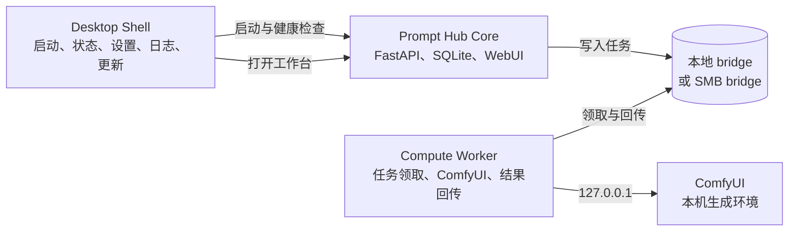

# Soda Prompt Hub 跨平台桌面产品计划书

> 文档状态：方案草案，可进入评审
>
> 适用范围：macOS Desktop、Windows Desktop、Windows Compute Worker
>
> 当前代码版本：保持 `1.1.0`，本计划不触发版本号变更

## 2026-09-12 使用方式收敛

- **Mac 管理 Windows**：Mac 启动器运行本机 WebUI；Windows 独立 Worker exe 在有效配置下自动启动接收服务。首次保存主机与共享名称，通过系统完成共享登录；以后启动器监测共享掉线并尝试重连一次，失败时保留手动入口。
- **Windows 单机**：Desktop 自动准备本机任务目录、独立 Worker 配置并启动 Worker/WebUI。ComfyUI 默认地址为 `http://127.0.0.1:8188`；不要求用户配置远程设备或另外打开 Worker exe。
- 本机 Worker 与远程 Worker 的安装配置分别放在 `Desktop Worker`、`Compute Worker`，不互相覆盖。模型目录为可选高级配置，不作为首次打开工作台的门槛。
- 不自动启停 ComfyUI、不创建 Windows 系统共享、不绕过首次权限/凭据确认。Mac 配对仍使用 SMB，不是免共享的网络直连协议。
- 动效只表达真实状态变化：首次入场、启动中提示、状态切换、按钮忙碌与操作结果；支持系统减少动态效果。

以下历史方案若与以上两种模式冲突，以本节为准。

## 1. 项目背景

Soda Prompt Hub 已具备本地资料管理、创作项目、结果审核、数据集整理、OC Manager 导入以及通过
Windows Worker 调用 ComfyUI 的能力。当前主要入口仍带有明显的工程工具特征：

- Mac 便携启动器可以无 Terminal 启动，但没有可见的品牌界面、进度、恢复操作和服务控制。
- Windows Worker 依赖 `.bat`、命令窗口和手工编辑 JSON，普通用户难以判断当前状态。
- 产品叙事默认偏向“Mac 管理、Windows 计算”，没有充分表达单台 Mac 或单台 Windows 也能独立使用。
- WebUI 已有明确的视觉语言，但桌面启动、安装、诊断和更新环节尚未形成同一套体验。

本项目拟把现有能力整理为一个统一的跨平台桌面产品，同时保留本地优先、可离线、数据可控和
Worker 可独立部署的优势。

## 2. 产品目标

### 2.1 核心目标

1. 提供真正可双击使用的 Mac `.app` 和 Windows `.exe`。
2. 启动、停止、诊断、日志和更新不再依赖用户理解 Terminal 或命令提示符。
3. Desktop Shell 与现有 WebUI 使用统一视觉语言和状态表达。
4. 支持单机资料管理、Windows 单机创作、多机协作三种模式。
5. 保留现有数据库、API、任务协议、Worker 配置和用户资料，不要求重新导入。
6. 把 Prompt Hub Core、Desktop Shell 和 Compute Worker 的职责分开，便于独立升级和排障。

### 2.2 非目标

- 第一阶段不重写 Prompt Hub Python Core。
- 第一阶段不重做现有 WebUI 的全部页面。
- 不把 ComfyUI、模型权重或训练工具直接捆入 Prompt Hub 安装包。
- 不把 SMB 密码、API Key 或其他凭据写入 Prompt Hub 配置。
- 不要求用户必须同时拥有 Mac 和 Windows。
- 不在方案阶段修改 `1.1.0` 版本号、创建 PR 或发布安装包。

## 3. 产品定位

产品统一命名为 **Soda Prompt Hub Desktop**，计算执行器命名为 **Soda Compute Worker**。

用户只需要理解两个概念：

- **工作台**：管理资料、OC、Prompt、创作、结果和数据集。
- **计算设备**：可选，用于连接本机或其他 Windows 电脑上的 ComfyUI。

“Mac 主机”“Windows 从机”只作为部署方式存在，不作为产品的强制使用模型。

## 4. 总体架构



### 4.1 Desktop Shell

面向用户的桌面入口，负责：

- 启动和停止 Prompt Hub Core。
- 显示启动步骤、健康状态和错误恢复入口。
- 打开 WebUI、日志目录、数据目录和设备设置。
- 在 Windows 上选择是否同时启动本机 Worker。
- 管理托盘或菜单栏状态。
- 执行受校验、可回滚的应用更新。

Desktop Shell 不直接处理 Prompt、图片、数据库或 ComfyUI workflow。

### 4.2 Prompt Hub Core

继续使用现有 Python/FastAPI 实现，负责：

- SQLite 数据库与本地资料。
- WebUI 和业务 API。
- OC、创作项目、结果审核与数据集。
- 计算节点配置、任务投递和结果验收。

### 4.3 Compute Worker

继续作为后台执行器，负责：

- 读取 bridge 中经过校验的任务。
- 调用 Windows 本机 `127.0.0.1` 上的 ComfyUI。
- 写回结果、状态、模型清单和 SHA-256 元数据。
- 保持单实例、路径白名单和协议兼容检查。

正式产品中默认隐藏命令窗口，由 Desktop Shell 管理生命周期；高级用户仍可保留命令行入口。

## 5. 运行模式

| 模式 | Prompt Hub Core | Worker | bridge | 典型用户 |
|---|---|---|---|---|
| 仅资料管理 | 本机 | 不需要 | 不需要 | Mac 或 Windows 单机整理资料、OC、Prompt、数据集 |
| Windows 单机创作 | Windows 本机 | Windows 本机 | 本地目录 | 一台 Windows 同时管理与使用 ComfyUI |
| 多机协作 | Mac 或 Windows | 另一台 Windows | SMB 共享目录 | 工作台与 GPU 分离 |

### 5.1 仅资料管理

首次启动选择“暂不连接计算设备”。所有不依赖 ComfyUI 的功能可以正常使用，设备页面显示为可选配置，
不把“尚未配置”误报为故障。

### 5.2 Windows 单机创作

Prompt Hub Core 与 Worker 都在同一台 Windows 上运行。`smb_mount` 指向本地工作目录，例如
`D:\SodaPromptHub\Bridge`，继续复用现有任务目录、manifest 和 SHA-256 验收流程，不需要建立 SMB。

### 5.3 多机协作

保持现有模式：工作台通过 Finder 或 Windows 网络驱动器挂载共享目录，Worker 在计算设备本机调用
ComfyUI。Desktop Shell 负责把“共享盘”“Worker”“ComfyUI”分别显示为独立状态。

## 6. 桌面体验设计

### 6.1 视觉语言

桌面入口沿用 WebUI 已建立的设计 token：

| Token | 值 | 用途 |
|---|---|---|
| `ink` | `#171815` | 主文字、深色状态区域 |
| `paper` | `#ece8dc` | 页面与卡片底色 |
| `paper-deep` | `#d8d1bf` | 次级面板和分组 |
| `signal` | `#a33822` | 主操作、错误和重要提醒 |
| `acid` | `#d7e455` | 正常状态、选中态和进度强调 |
| `muted` | `#5b5a53` | 次要说明 |

保留纸张质感、细边框、衬线大标题和 monospace 状态标签，避免通用 SaaS 渐变、玻璃拟态和过度圆角。

### 6.2 启动台首页

首页控制在一个紧凑窗口内，包含：

1. 品牌标题、版本和当前运行模式。
2. 三张状态卡：核心服务、资料库、计算设备。
3. 主要操作：“打开工作台”。
4. 次要操作：“重新启动”“查看日志”“设备设置”。
5. 最近一次错误及可执行的恢复建议。

### 6.3 状态语言

所有状态使用一致的五级模型：

| 状态 | 含义 | 示例 |
|---|---|---|
| `starting` | 正在启动或检查 | 正在启动核心服务 |
| `ready` | 可正常使用 | Worker 与 ComfyUI 均就绪 |
| `optional` | 未配置但不影响当前模式 | 尚未连接计算设备 |
| `attention` | 可以工作但建议处理 | Worker 版本较旧 |
| `failed` | 当前功能不可用 | SMB 断开或数据库初始化失败 |

错误提示必须回答三个问题：发生了什么、哪些功能受影响、用户下一步可以做什么。

### 6.4 菜单栏与系统托盘

- Mac：服务运行后可收起到菜单栏；提供打开工作台、状态、日志和退出。
- Windows：提供系统托盘；可选择启动 Prompt Hub、Worker 或两者。
- 自动启动必须由用户主动开启，默认关闭。
- 退出时明确区分“关闭窗口”和“停止后台服务”。

## 7. 技术方案

### 7.1 共享界面

新增一套轻量、无构建依赖的 HTML/CSS/JavaScript Desktop UI，作为两端共同资源：

```text
deploy/desktop-ui/
├── index.html
├── desktop.css
├── desktop.js
└── assets/
```

共享界面只渲染状态和发送受限命令，不直接访问文件系统。平台宿主通过清晰的 bridge API 提供：

- `getStatus()`
- `startCore()` / `stopCore()` / `restartCore()`
- `startWorker()` / `stopWorker()`
- `openWorkspace()` / `openLogs()` / `openDataFolder()`
- `getSettings()` / `saveSettings()`

### 7.2 macOS 宿主

在现有 `SodaPromptHubLauncher.swift` 基础上演进：

- AppKit 继续管理应用生命周期和 Python 子进程。
- 使用 `WKWebView` 加载共享 Desktop UI。
- 增加菜单栏入口、窗口重开和明确的退出行为。
- 继续使用 `127.0.0.1:8765/api/health` 验证服务身份。
- 保留 Documents 权限说明、日志轮换和 `ORT_DISABLE_TELEMETRY=1`。
- 第一阶段继续复用正式安装目录的 `.venv`，不立即捆绑完整 Python runtime。

### 7.3 Windows 宿主

推荐使用 C#/.NET 8 + WebView2：

- 生成正式的 `Soda Prompt Hub.exe` 和 `Soda Compute Worker.exe` 入口。
- 使用同一套 Desktop UI，避免 Windows 与 Mac 视觉漂移。
- 由宿主管理无窗口的 Python Core/Worker 进程、PID、日志和退出清理。
- WebView2 在 Windows 10/11 上成熟，正式安装器需检测并补装 Evergreen Runtime。
- 发布时采用 self-contained 或 single-file 构建，具体体积在原型阶段实测后决定。

不推荐把 Tkinter 作为正式商业界面；不推荐 Electron，因为体积和内存成本与本项目不匹配；暂不采用
Tauri，以避免在已有 Swift/Python 工程中同时引入 Rust/Node 构建链。若 Windows 原型证明双宿主维护成本
过高，再单独评估 Tauri 统一宿主。

### 7.4 本地进程与端口

- Core 默认绑定 `127.0.0.1:8765`。
- Worker 继续通过 bridge 文件协议工作，不开放新的局域网端口。
- Desktop Shell 启动前验证端口上的服务身份，不能只判断端口占用。
- 同一资料目录只允许一个 Core；同一 bridge 只允许一个 Worker。
- 崩溃恢复不得留下错误 PID 或永久锁。

### 7.5 数据与配置

建议统一配置模型，但保留平台目录规则：

| 内容 | macOS | Windows |
|---|---|---|
| 用户数据 | `~/Documents/Soda Prompt Hub` | `%USERPROFILE%\Documents\Soda Prompt Hub` |
| 应用状态 | `~/Library/Application Support/Soda Prompt Hub` | `%LOCALAPPDATA%\Soda Prompt Hub` |
| 日志 | `~/Library/Logs/Soda Prompt Hub` | `%LOCALAPPDATA%\Soda Prompt Hub\Logs` |
| 程序目录 | `~/Applications/Soda Prompt Hub` | `%LOCALAPPDATA%\Programs\Soda Prompt Hub` |

现有环境变量继续作为高级覆盖方式，Desktop Shell 设置页只暴露用户真正需要的目录和端口。

## 8. 安装、更新与回滚

### 8.1 Mac

- 第一阶段继续由现有安全安装/更新脚本构建 `.app`。
- 后续正式发布采用签名 `.dmg` 或 `.pkg`，并完成 notarization。
- 更新前备份用户资料和旧程序快照，失败自动恢复。

### 8.2 Windows

- 开发阶段提供便携 ZIP。
- 正式阶段提供签名安装器，并保留便携版作为高级选项。
- 安装器只安装 Prompt Hub、Desktop Shell 和可选 Worker，不安装模型权重。
- 更新必须使用 staging、manifest 校验和旧程序备份；保留真实 `worker-config.json`。

### 8.3 版本策略

- 方案和开发期间继续保持 `1.1.0`，避免为了中间产物频繁改版本。
- Desktop Shell、Core 与 Worker 在运行时分别报告版本和协议。
- 跨平台 Desktop 正式发布属于明显的新功能，建议发布评审时再决定是否进入 `1.2.0`。
- 协议兼容性独立于产品版本，继续使用显式 `protocol_version` 判断。

## 9. 分阶段实施计划

### 阶段 A：桌面产品基础

交付内容：

- 固化 Desktop Shell 信息架构、状态模型和平台 bridge API。
- 建立共享 `desktop-ui` 资源与视觉 token。
- 完成静态原型和桌面/高 DPI/中英文布局检查。
- 定义启动、失败、恢复和退出状态机。

验收标准：

- Mac 与 Windows 原型使用同一套界面资源。
- 五类状态均有可复现演示和明确操作。
- 不依赖 Core 成功启动也能显示错误与日志入口。

### 阶段 B：Mac Desktop Shell

交付内容：

- 将现有原生 launcher 升级为带品牌窗口的 Desktop Shell。
- 增加启动进度、服务控制、日志入口和菜单栏。
- 保持双击复用、无 Terminal、权限引导和子进程清理。
- 接入现有安装与安全更新流程。

验收标准：

- 首次安装、首次权限、冷启动、重复双击、重启、退出均可验证。
- Core 启动失败时可以从窗口直接查看日志并重试。
- 现有资料目录和数据库不迁移、不复制。

### 阶段 C：Windows Worker Desktop

交付内容：

- 用图形界面替代 `0/1/2` 三个 `.bat` 的日常入口。
- 提供目录选择器、配置校验、ComfyUI 状态、Worker 启停和托盘。
- `.bat` 保留为排障与兼容入口。
- 构建可校验的 Windows 便携包。

验收标准：

- 普通用户无需编辑 JSON 即可完成首次配置。
- Worker 后台运行时不显示命令窗口。
- Desktop Shell、状态文件和 Mac 设备页报告一致。
- 旧 `worker-config.json` 可无损升级。

### 阶段 D：Windows 完整单机版

交付内容：

- 打包 Prompt Hub Core、WebUI、Desktop Shell 和可选 Worker。
- 首次启动向导选择“仅资料管理”“本机 ComfyUI”“远程计算设备”。
- 本机计算模式自动建立本地 bridge 和节点配置。
- 增加 Windows 数据目录、备份、更新和卸载策略。

验收标准：

- 一台干净 Windows 设备可以完成安装、初始化和打开 WebUI。
- 不配置 Worker 时资料管理功能完整可用。
- 配置本机 ComfyUI 后无需 SMB 即可投递并回收测试任务。
- 卸载程序不删除用户资料，除非用户明确选择。

### 阶段 E：发布工程与商业化收口

交付内容：

- Mac Developer ID 签名与 notarization。
- Windows Authenticode 签名与安装器。
- 自动构建、manifest、SBOM、升级和回滚验证。
- 用户指南、隐私说明、故障诊断包和发布清单。

验收标准：

- 两个平台均不出现未知发布者或损坏应用提示。
- 离线启动可用，网络功能失败不影响本地资料。
- 更新失败可恢复到上一版，数据库与用户资料完整。

## 10. 测试矩阵

### 10.1 功能测试

- Core 已运行、未运行、启动失败、端口被占用。
- Worker 已运行、未运行、版本过旧、协议不兼容。
- ComfyUI 已运行、未运行、返回错误。
- 本地 bridge、SMB bridge、只读 bridge、断线重连。
- 重复双击、同时启动、退出、系统重启后恢复。
- 首次安装、覆盖更新、失败回滚和保留配置。

### 10.2 平台测试

- macOS 12 及以上，Apple Silicon 为主，必要时补 Intel 验证。
- Windows 10 22H2 与 Windows 11，普通用户权限运行。
- 100%、125%、150%、200% DPI。
- 简体中文、繁体中文和英文。

### 10.3 安全测试

- Core 与控制接口仅绑定 loopback。
- Desktop WebView 禁止任意导航、远程脚本和未授权文件访问。
- bridge 路径不能越界。
- 更新包、Worker 和生成结果均校验 SHA-256。
- 日志和诊断包不得包含密码、token 或 API Key。

## 11. 风险与应对

| 风险 | 影响 | 应对 |
|---|---|---|
| 范围从启动器扩大为重做业务系统 | 周期失控 | Core 与现有 WebUI 第一阶段不重写，按 A-E 分阶段验收 |
| 两个平台宿主行为不一致 | 用户体验漂移 | UI 资源和 bridge API 共用，平台代码只处理生命周期和系统能力 |
| Windows 打包体积或杀毒误报 | 安装信任下降 | 使用签名 .NET 宿主，避免 PyInstaller 作为正式外壳 |
| WebView2 缺失 | Windows 无法显示界面 | 安装器检测并提供 Evergreen Runtime |
| Python runtime 依赖导致便携性不足 | 新设备启动失败 | 先验证外部 runtime，再进入自包含 runtime 阶段 |
| 本地与远程 bridge 配置混淆 | 任务投递错误 | 首次向导明确选择模式，并在设备页显示真实路径和归属 |
| 后台进程无法正常退出 | 数据或锁损坏 | 单实例、受控终止、超时升级和崩溃恢复测试 |
| 自动更新破坏配置 | Worker 或 Core 无法启动 | staging、manifest、配置白名单迁移和旧目录快照 |

## 12. 首轮建议范围

建议第一轮只实施阶段 A 与阶段 B：

1. 建立共享 Desktop UI。
2. 把当前 Mac launcher 升级为可见的品牌启动台。
3. 完成启动、错误、日志、重启和菜单栏体验。
4. 冻结 Desktop bridge API，供 Windows 宿主直接复用。

第一轮不打包 Windows 完整版，也不改变 Worker 协议。这样可以先用当前 Mac 环境把视觉、状态机和
进程管理做扎实，再进入必须在 Windows 实机上构建和验收的阶段 C、D。

## 13. 评审决策

建议采用以下默认决策：

- [x] 产品允许完全单机使用。
- [x] Worker 是可选后台组件，不是产品主界面。
- [x] Mac 与 Windows 共用 Desktop UI，宿主分别原生实现。
- [x] 自动启动默认关闭，由用户主动开启。
- [x] 现有 `.command` 和 `.bat` 暂时保留作维护入口。
- [x] 开发阶段不修改 `1.1.0`，发布评审时再决定新版本号。
- [ ] 确认第一轮按阶段 A + B 开始实施。

## 14. 完成定义

跨平台桌面产品完成时，用户应当能够：

1. 在 Mac 或 Windows 双击一个有品牌感的应用入口。
2. 不接触 Terminal 或命令提示符即可理解系统状态并处理常见问题。
3. 在没有第二台设备时完整使用资料管理功能。
4. 在 Windows 单机连接本机 ComfyUI，或选择另一台 Windows 作为计算设备。
5. 安全升级 Core 与 Worker，同时保留数据库、配置和历史任务。
6. 从界面直接查看版本、协议、日志、数据位置和诊断结果。
